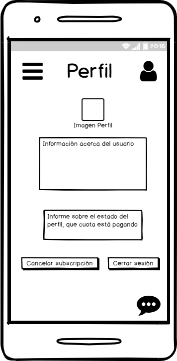
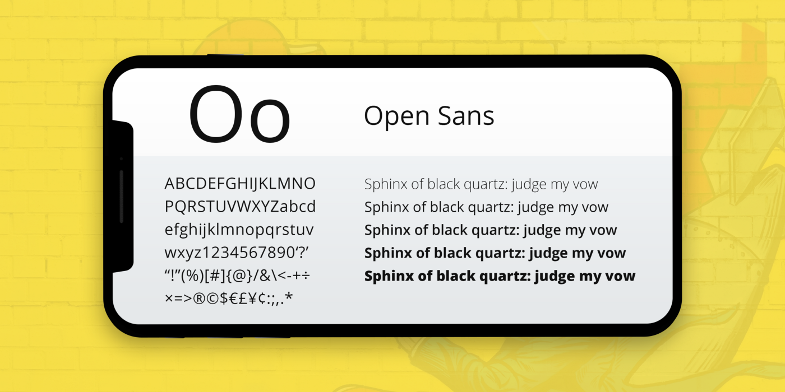

# DIU_TrabajoFinal-2020

Descripción: Nuestro objetivo es realizar un análisis y rediseño de la página detinada a coworking [Cubikate](https://cubikate.es), utilizando los distintos elementos y análisis que hemos ido desarrollando en las prácticas de la asignatura.

Autor
 * David Gómez Hernández
 
## Paso 1. UX Desk Research & Analisis 

### 1.a Competitive Analysis
He elegido la web de [Cubikate](https://cubikate.es) ya que al compararla y barajarla con la otra opcion [erranT](https://www.errant.es/es/), se veía que tenía un diseño algo más simple pero elaborado, además que daba la información clara y no presentaba errores a la hora de acceder a algún submenú. Sin embargo, tiene algunos fallos que veremos luego en el Usability Review.

### 1.b Persona

 Persona 1

He elegido a esta persona ya que representa al tipo de usuario que quiere empezar nuevos proyectos en algún lugar agradable.

 Persona 2

He elegido a esta persona porque representa el cambio de aires que pueda necesitar un usuario, buscando un espacio donde poder trabajar libremente.

### 1.c User Goals and Pain Points
En vez de realizar un Journey Map con las distintas personas como hemos hecho en las prácticas, voy a analizar los objetivos que quieren tener los usuarios así como sus preocupaciones

### Goals
Los objetivos de los dos personas son:
- Encontar un buen lugar donde trabajar
- Crecer en sus ámbitos laborales y financieros

### Pain Points
Como pain points encontramos:
- No quiere que se les moleste, quieren mantener su libertad dentro del servicio.

### 1.d Usability Review
Nota final del Usability Review: 52/100
Si analizamos los puntos buenos y malos característicos de la página podemos observar que:
- Puntos buenos: EL estilo y la simplicidad de la página es agradable para la vista, siendo no muy complicado navegar por ella al utilizar la tecnología de WordPress.
- Puntos malos: La página apenas ofrece información sobre los precios que pueden suponer su principal atractivo, que es el alquilar un lugar donde poder trabajar junto con más gente. Además de la falta clara de información, también es muy repetitiva, repitiendo información cada vez que puede y poniendo el formulario de contacto al final de cada apartado. Además, la estructura del diseño en sí es un poco floja y no muy profesional.

[UsabilityReview](https://github.com/DavidGmezHdez/DIU_TrabajoFinal-2020) 

## Paso 2. UX Desing
### 2.a feedback Capture Grid

 

La propuesta de valor que puedo dar es rediseñar la página de forma que mantuviera un diseño estético igual de simple pero que diera más información sobre el alquiler y demás servicios. Además se le agregarían funciones extra como menos uso del formulario y un chat entre los usuarios que estén dentro de la aplicación, de forma que puedan estar conectados y poder preguntarse más a menudo.
Además, pretendo incluir más información acerca de la accesibilidad al servicio web, tratando que sea lo más accesible para todo tipo de discapacidad y un buscador para buscar información sobre algún tema en cuestión.

### 2.b Wireframes y patrones de diseño

Para la investigación de diseño y patrones he consultado las páginas que se nos dio en la respectiva práctica, obteniendo algunos patrones que nos pueden servir para la aplicación que vamos a hacer.

1.Navegación y exploración de la aplicación:  
    **- Organizar y etiquetar las categorías del menú**  
        Se realiza una agrupación correcta en las categorías del menú para no confundir al usuario y que se queden bien diferenciadas. 
    **- Colocar el campo de búsqueda en una posición destacada**  
        Es vital que los usuarios puedan acceder de forma rápida al campo de búsqueda y que sea visualmente fácil localizarlo, para ello tenemos un cuadro de búsqueda en la parte central justo debajo del logo.  
2.Registro:  
    **- Ofrecer una utilidad clara antes de solicitar el registro**  
        Una aplicación que impide ver sus funciones antes de registrarse, puede provocar desconfianza en los usuarios. La aplicación permite su visualización sin tener que registrarse. Si quieres hacer log-in, simplemente se pulsa el botón de arriba a la derecha.

**Respecto a [ui-patterns](https://ui-patterns.com/) :**   
    **- Autocomplete Design Pattern**  
        Para las búsqueda es útil seguir el diseño de autocompletado, permitiendo a los usuarios realizar las búsquedas más rápidas. Para ello se van mostrando búsquedas o sugerencias para lo que el usuario ha escrito hasta ese momento.  
    **- Chat Design Pattern**  
        Es vital que los usuarios puedan chatear sin tener que salirse del sistema. El chat permite hablar de forma global con todos los usuarios del sistema y también de forma privada e individual con un usuario concreto. Para seguir este patrón es necesario proporcionar una ventana para el chat, una barra para enviar esos mensajes y un ventana que muestre dichos mensajes, será necesario que quede por encima del resto de funciones de la aplicación (para no tener que salir de esta) y mostrar de forma clara esa división entre el chat de todos los usuarios y los privados.
    **- Menú hamburguesa**
        Debido a que queremos hacer que nuestra aplicación sea accesible, hemos pensado que hacer una sola página que contenga toda la información puede ser lo mejor. La página principal de nuestra aplicación estará dividida en secciones. Podrás acceder a esas secciones deslizando hacia arriba o hacia abajo en la pantalla o bien usar la herramienta de la hamburguesa, la cual será un botoncito desplegable que cuando le des te muestre las diferentes secciones a las que puedes ir, y si haces click, la propia aplicación te llevará a esa sección. Todo esto sin recargas de página. Esta herramienta si se usa bien garantiza bastante eficiencia y velocidad de manejo, además que su uso es bastante extendido en otras aplicaciones.

### Paleta de colores
En cuanto a la paleta de colores, los colores usados ahor amismo son bastante adecuados para el diseño de una página de este estilo.

### Logo
El logo en el caso de la propia página es un poco soso y falto de estilo, además que en el navegador pasa un poco desapercibido debido a los colores usados. El logo que propongo puede dar un lavado de cara al servicio, así como ser reconocido ya que tiene más carisma que el anterior.

### Tipografía
En cuanto a tipografía, a día de hoy se utiliza mucho la de "Roboto" y sus variaciones. Sin embargo, creo que usando la de Open Sans puedes mejorar aún más la página y la aplicación, ya que cuenta con su carisma propio.

## Valoración Personal
A modo de vista personal, el diseño de la página original deja mucho que desear, y a pesar de haber utilizado una tecnología que puede ser muy útil como es WordPress, parece como si se hubiera hecho de forma algo vaga y sin tener mucho cuidado sobre cómo plantear un buen diseño desde el principio. POr ello es necesario el rediseño, ya que actualizaríamos la página para que se viera mucho mejor, con nuevas funcionalidades y abierta para nuevos clientes potenciales.

Gracias a este trabajo he podido comprobar a modo personal lo que he aprendido tanto en los trabajos de prácticas como con los de teoría. A medida que se iban desarrollando los ejercicios, íbamos adquiriendo una serie capacidades y conocimientos que luego, para hacer este trabajo, han sido útiles. Sobretodo con las capacidades adquiridas en cuanto accesibilidad, ya que podemos analizar las páginas de una forma que no nos habíamos planetado antes y reflejarlas en el usability review.
